# Izveštaj o zatečenom stanju

> Sudski veštak
> **dr Milan Radošević**
> Novi Sad, Branka Bajića 9N
> mob. 060 64 111 96
> mejl: r.milan13@gmail.com
>
> *Ex minimus seminibus nascuntur ingentia*

**VUKOVIĆ COMMERCE 2015 D.O.O.**
Novosadski put br. 106
Novi Sad

**PREDMET: IZVEŠTAJ O ZATEČENOM STANJU**

Na osnovu ličnog zahteva preduzeća Vuković Commerce 2015 D.O.O. iz Novog Sada,
izvršen na dan ugovorene primopredaje (11.09.2025. godine) pregled samohodne barže
**Bečej 1** koja se nalazila na lokalitetu Perlez kod prevodnice Perlez.

Na osnovu zakazanog sastanka za primopredaju predmetne samohodne barže, primopredaji
su prisustvovali:

- Milan Mišić – advokat
- Dejan Dimitrijević
- zaposleni iz preduzeća „Begej Shipyards Group d.o.o, Zrenjanin“
- Milan Radošević – sudski veštak

---

## Izveštaj o zatečenom stanju

Na osnovu pregleda predmetnog plovila – samohodne barže Bečej 1 daje se sledeći
**izveštaj o zatečenom stanju**.

Na osnovu uvida u predmetno plovilo, koje je bilo predmet ugovorene primopredaje,
zaključuje se da se radi o plovilu sa sledećim karakteristikama:

| Karakteristika | Vrednost |
|---|---|
| Vrsta plovila | samohodna barža (motorni teretnjak) |
| Proizvođač | Balatonfüred, Mađarska |
| Godina proizvodnje | 1978 |
| Naziv plovila | BEČEJ 1 |
| Nosivost | 891,1 tona |
| Vrsta pogonskih agregata | dizel motori |
| Broj i vrsta pokretača | dva Z pogona |
| Najveća dužina | 69,71 m |
| Najveća širina | 8,62 m |
| Gaz broda (bez tereta – najveći) | 0,65 m |
| Gaz broda (sa teretom – najveći) | 2,15 m |

Pregledom predmetnog plovila na dan primopredaje utvrđeno je da je isti u neispravnom
i nefunkcionalnom stanju. Predmetna oštećenja su fotografisana. Fotografije se nalaze
u prilogu izveštaja i sačinjavaju njegov sastavni deo.

### Uočeni nedostaci

- nedostaje agregat
- oštećena brodska kabina
- oštećena vrata kabine
- nedostaje radar
- nedostaje radio stanica
- oštećena električna instalacija (isečena)
- oštećene brodske kabine – stambeni prostor (vandalizovan)
- **sredstvo poriva/pogona** – nedostaju 2 (dva) brodska propulzera sa celokupnim
  sistemom (Schottel) – dva Z pogona
- oštećenje mašinskog prostora
- razvodni ormani pokradeni sa isečenom električnom instalacijom
- oštećen jedan pogonski agregat (motor) – skinuta glava motora
- hidraulična instalacija u mašinskom prostoru isečena
- pokradeni spojni elementi od pogonskog agregata do propulzera

---

## Zaključak

Nakon uočenih nedostataka na predmetnom plovilu, od strane pravnog zastupnika
preduzeća Vuković Commerce 2015 D.O.O. iz Novog Sada, izvršena je prijava nadležnoj
policijskoj upravi koja je izašla na lice mesta i izvršila inspekciju i pregled
predmetnog plovila.

Zaposleni iz preduzeća „Begej Shipyards Group d.o.o, Zrenjanin“ koji su došli na
ugovorenu primopredaju, odmah nakon kontaktiranja policijske uprave od strane pravnog
zastupnika preduzeća Vuković Commerce 2015 D.O.O. iz Novog Sada, a pre dolaska
policijskih službenika, napustili su mesto ugovorenog sastanka.

Obzirom na obim oštećenja koje je utvrđeno na dan pregleda, potrebno je izvršiti
celokupnu defektažu plovila od strane odgovarajućih servisera (mašinsko/elektro
struke) kako bi se utvrdila visina materijalne štete potrebne za popravku plovila,
odnosno da se utvrdi opravdanost (ekonomičnost) popravke predmetnog plovila.

---

Sudski veštak\*:
**dr Milan Radošević**

Prilozi:
1. fotodokumentacija

U Novom Sadu, 24.09.2025.

> \* Po Rešenju BR 740-05-02215/2014-22 od 08.12.2014. godine, Ministarstvo pravde
> Republike Srbije.

---

## Prilog: Fotodokumentacija

> Napomena: slike su renderovane stranice originalnog PDF-a (samo pregled / „baci pogled“).
> Stranice 3–6 sadrže fotografije oštećenja uz tekst, a stranice 7–15 su fotodokumentacija.

### Oštećenja uz tekst nalaza

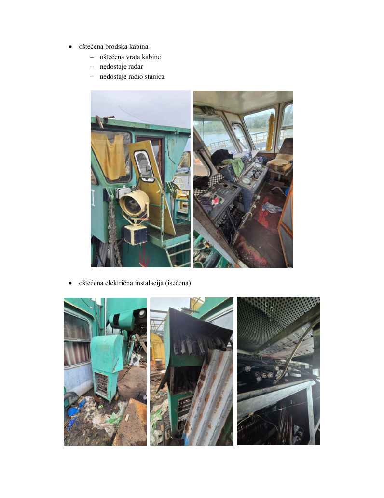
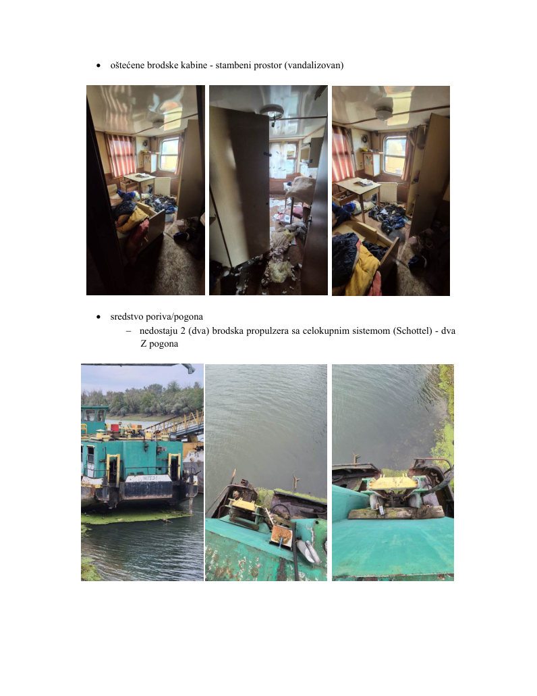
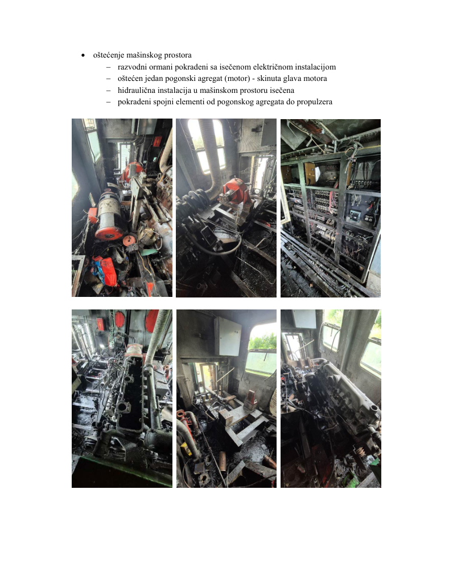
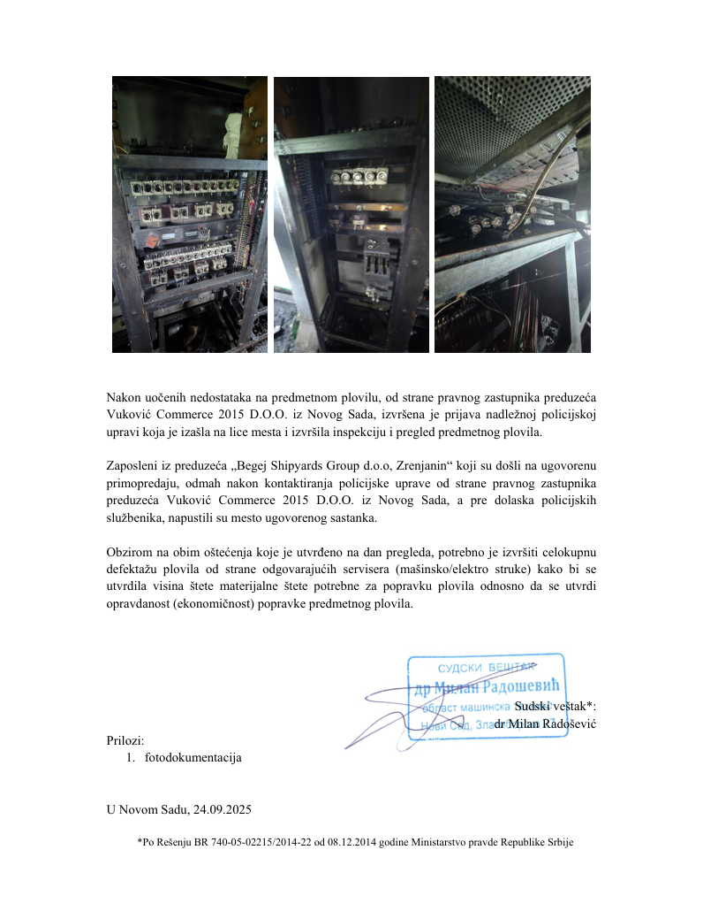

### Fotodokumentacija (prilog)

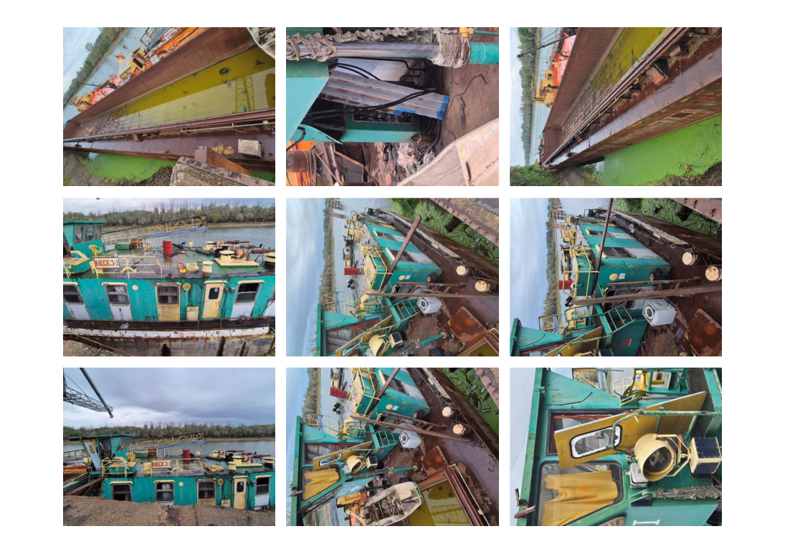
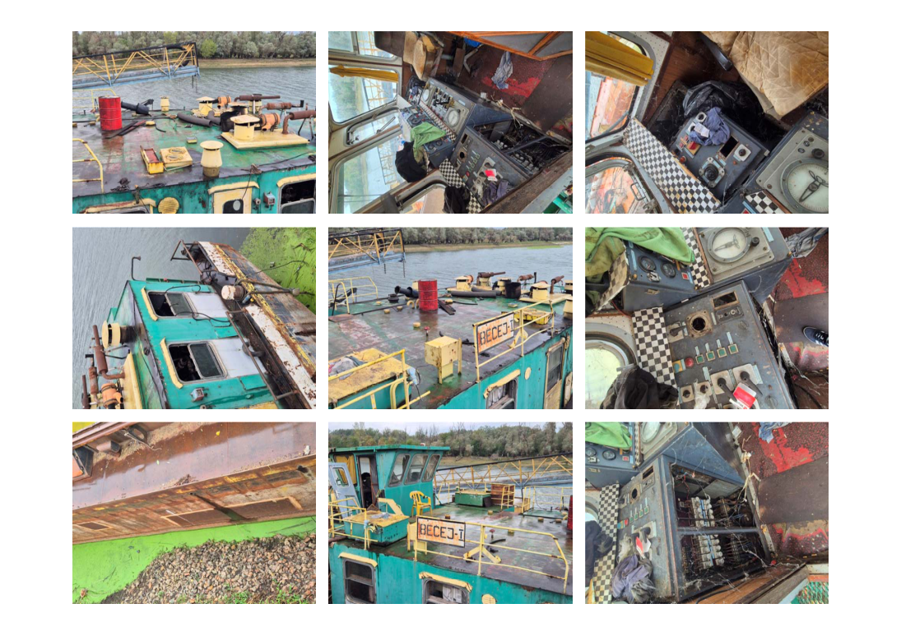
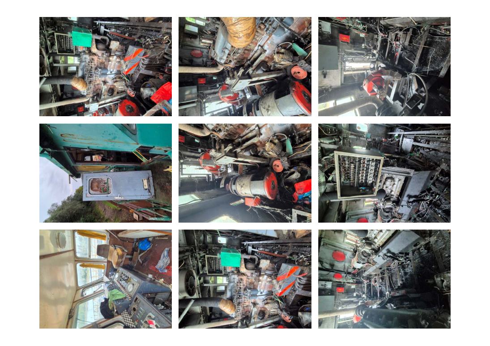
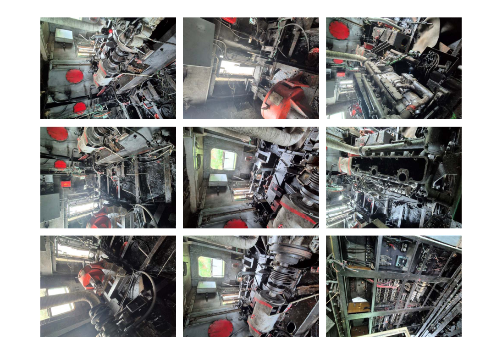
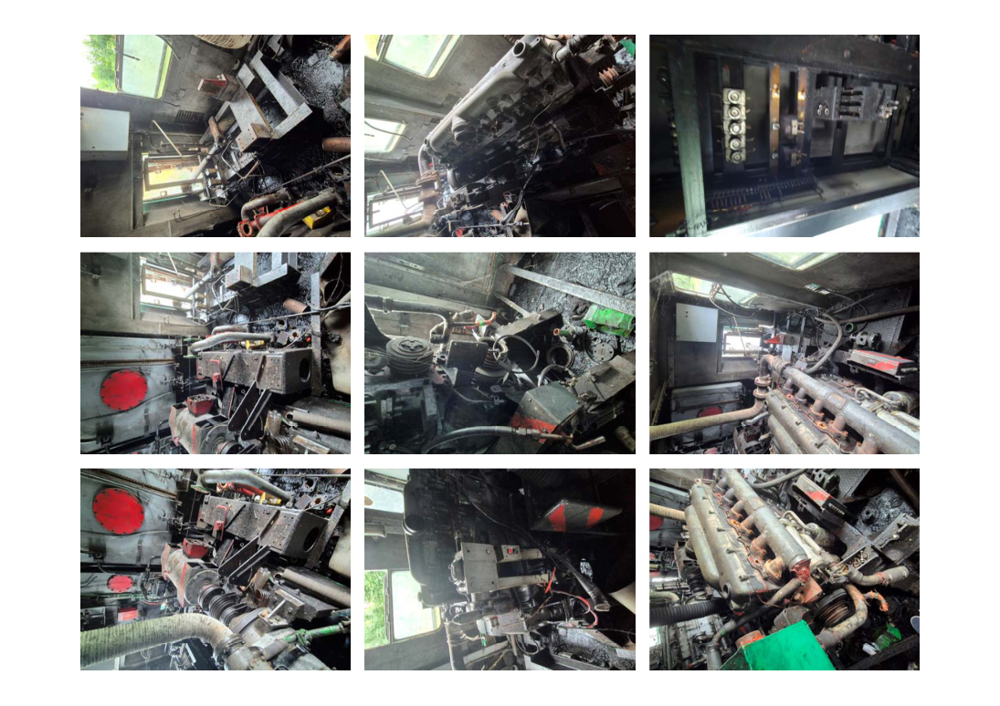
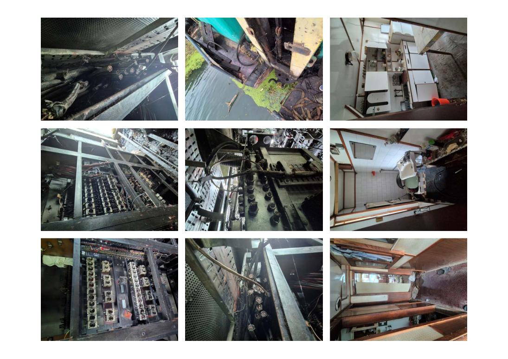
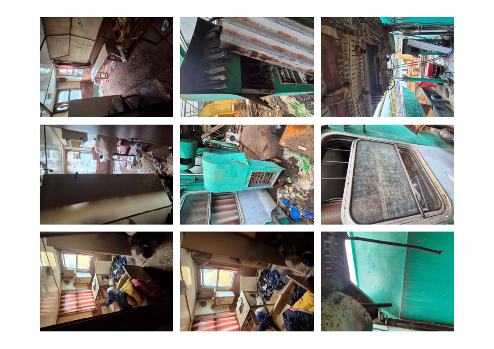
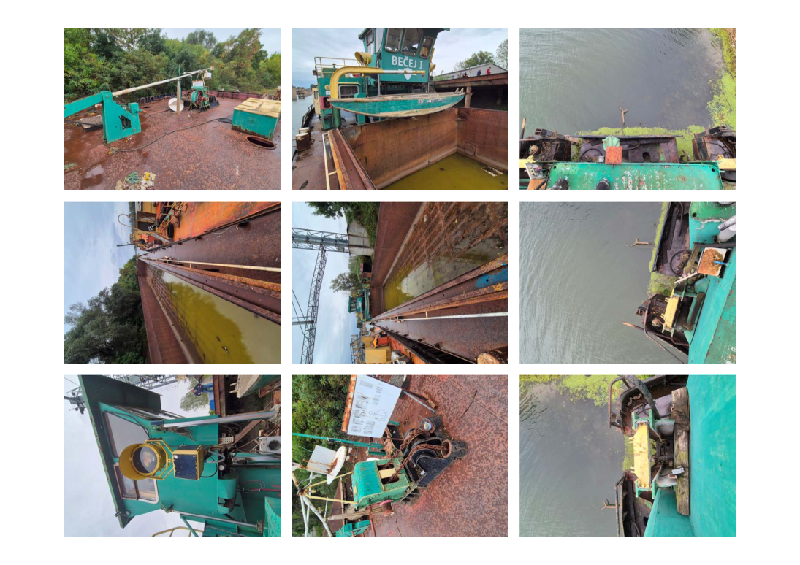
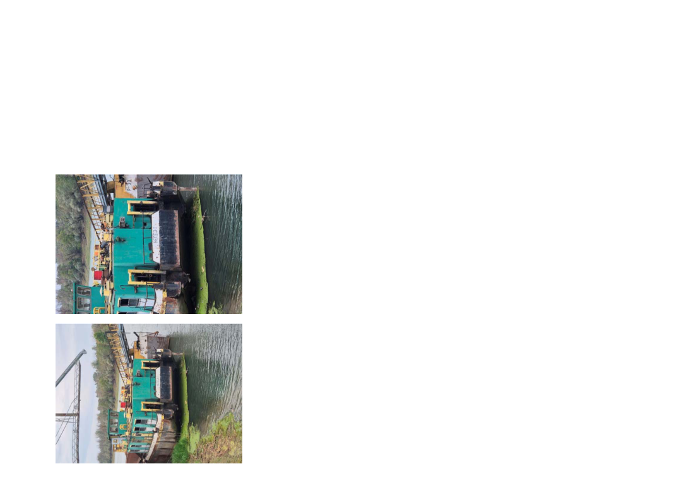
